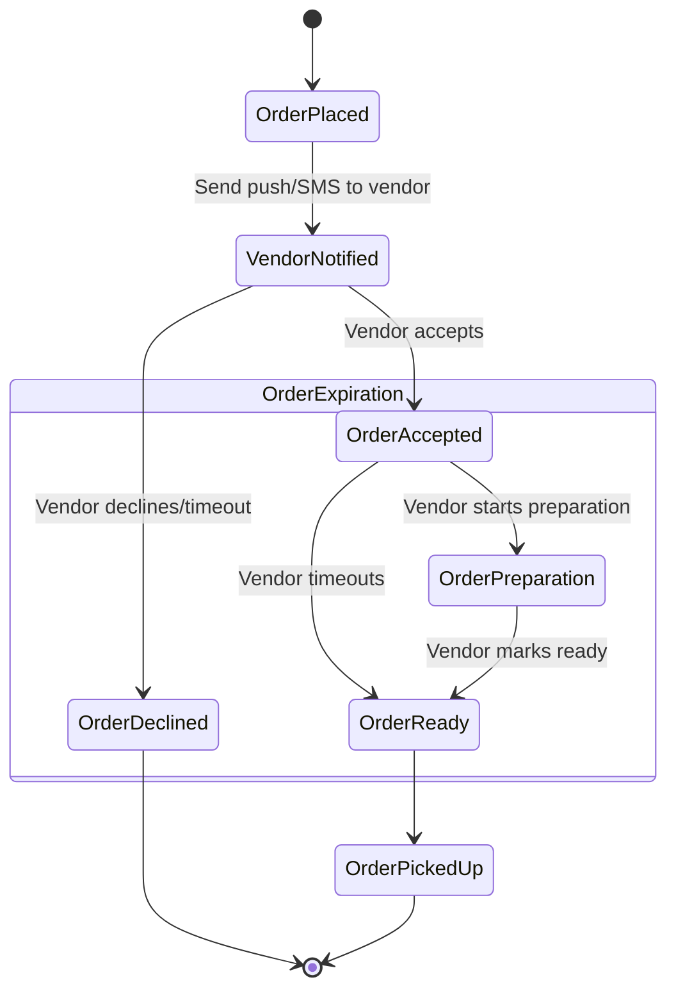

# Order Notification

This workflow manages a pick up order for users. The user places an order through
a food ordering application and the vendor prepares the order.

## State machine



## Getting started

From the root directory of the project, use `uv` to run a workflow runner:

```bash
uv run -m order_notification.runners.workflow
```
